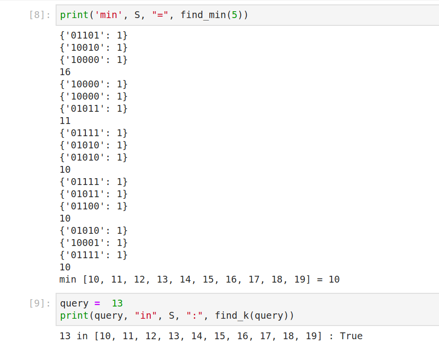

---
title: Modified Grover Search for Databases
subtitle: Quantum Computing Group Project
date: 2019-07-19
author:
 - J. Imbery
 - S. Santamaria
 - M. Signer
header-includes:
 - \usepackage{physics}
...

# Element Search in Database 

## Our $U_\omega: \ket{x} \ket{y} \to \ket{x} \ket{y \oplus f(x)}$

### For element search: $f(x) := x = k$

Let $X_{\bar k} = \bigotimes_{i=1}^{n} \begin{cases}
\mathbf{X} & \text{if the $i$-th bit of $k$ is 0}\\
\mathbf{I} & \text{otherwise}
\end{cases}: \ket{x} \to \ket{x \oplus \bar k}$,
and $U_\wedge: \ket{x}\ket{y} \to \ket{x}\ket{y \oplus \bigwedge_{i=1}^n x_i}$

Then $U_\omega = (X_{\bar k}) (U_\wedge) (X_{\bar k})$

{height=4cm}

## Modified diffusion operator $U_s$

In the standard Grover search, we mirror around the (fixed) starting state $\ket{s}
= \frac{1}{\sqrt{N}} \sum_{i=0}^{2^n} \ket{i}$: $U_s = \mathbf{I} - 2\dyad{s}{s} = \mathbf{I} - \frac{2}{N} \mathbf{1}$

However, our starting state is given by $\ket{s} = A \ket{0}$.

We can use the distributive property:

$U_s = \mathbf{I} - 2 A \dyad{0} A^H = A \mathbf{I} A^H - 2 A \dyad{0} A^H = (A) (\mathbf{I}-2\dyad{0}) (A^H)$

So we can implement mirroring about $\ket{s}$ by first doing a isometric
transform $A^H = A^{-1}$, then mirroring about $\ket{0}$ (which we already
implemented with our $U_\omega$), and then transforming back with $A$!

## Iterative search for a single element

Consider the two cases: $k \in S, k \not \in S$:

In the first case, this will be a standard Grover search for one of $N$
elements. Then we will extremely likely get $k$ as a measurement of $\ket{x}$
(we can just measure multiple times to further increase the probability).

In the second case, our Grover iteration will be an identity operation, so in the end we will get a random element from $S$ (which obviously won't be $k$).

So we can say $k \in S \Leftrightarrow \ket{x} \text{ measured as $k$ at least once}$.

# Minimum Search in Database

## Our $U_\omega: \ket{x} \ket{y} \to \ket{x} \ket{y \oplus f(x)}$

### For minimum search: $f(x) := x < k$

This is already implemented in Qiskit aqua with `qiskit.aqua.circuits.FixedValueComparator`

### For maximum search: $f(x) := x > k$

`FixedValueComparator` can also implement a $\geq$ comparison.

We can turn this into $>$ by adding one to $k$, or we can use the fact that
$\bar x = 2^n-1-x$, i.e. flipping all bits reverses the order. So we can flip all qubits of $x$, then compare with $\bar k$ and then flip back.

The rest of the algorithm for maximum search will be analogous to the minimum version.

## Iterative search for the minimum

- $m \gets \infty$
- repeat $K$ times:
  - Using modified Grover search, boost the $x \in S : x < m$
  - $m \gets \min(m, x)$

Unlike the single-element Grover search, we don't know $\dim \ket{good}$ (the
number of matching elements), so we don't know how many iterations to do.
Instead, try different numbers of iterations, up until the number we would need
for finding a single element: $1, 2, 4, \dots, \left[\frac{\pi}{4 \arcsin
\frac{1}{\sqrt N}}-\frac{1}{2}\right]$. The total time will still be $\mathcal{O}(\sqrt{N})$.

It can be proven that at least one of these iteration counts will have a good
boosting effect, so it is very likely that we will actually find a smaller
element. Because all smaller elements have the same probability of being
chosen, the expected number of remaining elements will be cut in half every
iteration. As such, we only need $\mathcal{O}(\log N)$ iterations to find the
correct minimum.

## Results

